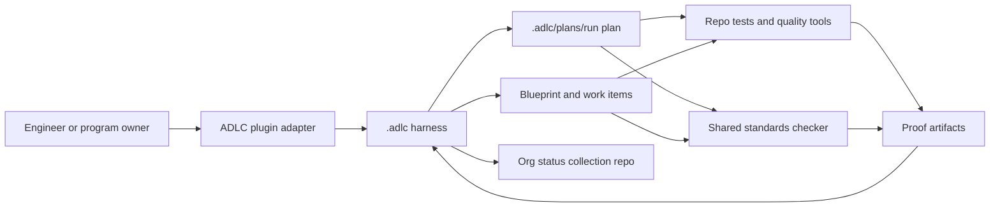
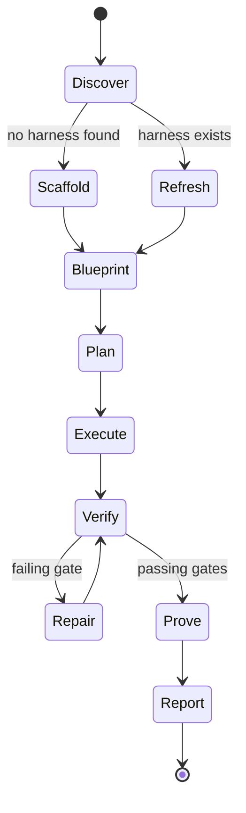

# ADLC Harness Architecture

Date: 2026-05-19

## Purpose

The ADLC harness is a plugin-first operating layer that lets Claude, Codex, and Auggie perform the same development lifecycle with different host runtimes. The installed plugin is the platform-native discovery and execution surface. The target repository keeps shared task state, plans, validation commands, standards reports, and proof artifacts under `.adlc/`.

The harness is not a replacement for the shared standards checker. It wraps the checker with planning, task slicing, verification, and handoff artifacts so agents can steer feature work, bug fixes, unit-test expansion, remediation, and org-scale reporting.

## Design Principles

1. Keep the shared ADLC policy in `standards/`.
2. Keep repo-local execution state in `.adlc/`.
3. Keep platform differences in the plugin packages, not in target-repo platform folders by default.
4. Make every long-running task restartable through durable status and proof artifacts.
5. Treat tests, coverage, security, and standards reports as first-class completion evidence.
6. Prefer deterministic quality gates over prompt-only instructions.
7. Write every task plan to a platform-independent `.adlc/plans/<run>/` directory before implementation.

## Default Harness Layout

```text
target-repo/
  .adlc/
    harness.yaml
    lifecycle.json
    status.md
    blueprints/
      feature-blueprint.yaml
      bugfix-blueprint.yaml
      unit-test-blueprint.yaml
      orchestration-blueprint.yaml
    plans/
      <YYYY-MM-DD>_<task-slug>/
        plan.md
        plan.yaml
        tests-and-evals.md
        work-items.md
        state.json
    work-items/
      README.md
    proofs/
      README.md
    reports/
      README.md
    runbooks/
      harness-steerer.md
      validation-loop.md
```

`WORKFLOW.md` is optional. It can be written when a repo wants a repo-local workflow contract, but the default plugin-first path only initializes `.adlc/`.

Repo-local platform override files are also optional. They are installed only when the initializer is run with an explicit flag such as `--install-local-overrides claude,codex,augment`; existing local harness files are skipped unless `--force` is requested.

## What The Plugin Installs

The plugin packages provide discovery and execution. They do not rely on `.adlc/` for platform discovery.

| Platform | Plugin-provided surface | Target-repo platform folders |
| --- | --- | --- |
| Claude | slash commands, specialist agents, skills, docs, scripts, and standards bundle | `.claude/` is not written by default |
| Codex | skills, bundled deterministic scripts, docs, and standards bundle | `.codex/` is not written by default |
| Auggie | marketplace commands, agents, skills, docs, scripts, and standards bundle | `.augment/` is not written by default except optional project settings |

The target repo receives shared ADLC state only when a harness is initialized. Existing local harnesses remain valid and are recorded as integration context.

## Shared `.adlc/` State

`.adlc/` is the platform-independent system of record:

- `harness.yaml`: distribution model, profiles, blueprints, and detected local harnesses
- `lifecycle.json`: current lifecycle phase, active plan, task metadata, and history
- `status.md`: human-readable handoff and current validation state
- `plans/<run>/`: canonical plan, plan YAML, tests and evals, work items, and state JSON
- `proofs/`: proof of functionality, remediation, or org rollout progress
- `reports/`: standards, security, quality, and coverage reports

## Core Components



## Harness Lifecycle



## Archetypes

| Archetype | When to use | Required proof |
| --- | --- | --- |
| Feature | New user-visible or API behavior | failing-to-passing test, acceptance checks, standards report |
| Bug fix | Reproduce and repair a defect | reproduction proof, regression test, fix proof |
| Unit test | Expand coverage around existing logic | coverage artifact, focused test run, gap summary |
| Orchestration | Multi-repo or issue-driven work | repo list, per-repo reports, org metrics rollup |
| Remediation | Standards or security cleanup | before and after reports, prioritized fix log |

## Platform Adapter Contract

The same `.adlc/` layout is used by all supported coding agents, but discovery comes from the installed plugin.

| Platform | Adapter responsibility |
| --- | --- |
| Claude | Plugin commands, agents, and skills read `.adlc/`, create canonical plans, review implementation, and update status. |
| Codex | Plugin skills and scripts scaffold `.adlc/`, create canonical plans, run standards, implement bounded work items, and create proof artifacts. |
| Auggie | Marketplace commands, agents, and skills drive the same workflow from Augment's context and rule system. |

Repo-local `.claude/`, `.codex/`, and `.augment/` files are optional overrides or existing repo-specific harnesses. ADLC detects and records them in `.adlc/harness.yaml`, but does not create generic platform-local files by default.

The shared deterministic conductor is `scripts/steer-adlc-harness.py`. Plugin commands and skills can call it to initialize `.adlc/` if needed, create the canonical plan, update `lifecycle.json`, and append the active plan handoff to `status.md`.

## Remediation Routing

Task-specific remediation workflows enter the same lifecycle. For Project CodeGuard, `fix-project-codeguard-findings` must call the conductor before code edits:

```bash
python3 scripts/steer-adlc-harness.py --repo-path . --task-type remediation --title "Project CodeGuard remediation" --source-report reports/project-codeguard-security.json
```

The resulting `.adlc/plans/<run>/` directory must identify the findings, tests, evals, security checks, standards checks, bounded work items, and proof requirements. Implementation starts only after that plan exists.

For generic org standards remediation, `fix-org-standards-findings` reads `reports/org-standards.json`, selects a bounded recommendation slice, writes selected and out-of-scope recommendations into `.adlc/plans/<run>/`, and stops in plan-only mode unless the user explicitly approves implementation:

```bash
python3 scripts/fix-org-standards-findings.py --repo-path . --source-report reports/org-standards.json --priority low --max-items 3
```

## Plan Artifact

The `Plan` lifecycle phase must produce a platform-independent plan before implementation:

```text
.adlc/plans/<YYYY-MM-DD>_<task-slug>/
  plan.md
  plan.yaml
  tests-and-evals.md
  work-items.md
  state.json
```

Claude, Codex, Auggie, Superpowers, or existing local harnesses may help draft the plan, but the `.adlc/plans/<run>/` directory is the canonical source of truth.

## Sequence Diagrams

Detailed WebSequenceDiagrams source files live in:

- `ADLC/docs/diagrams/adlc-harness-steerer.wsd`
- `ADLC/docs/diagrams/org-status-rollout.wsd`

## Source Alignment

This design incorporates:

- EPAM ADLC lifecycle framing: https://www.epam.com/insights/ai/blogs/agentic-development-lifecycle-explained
- Anthropic long-running harness handoff artifacts: https://www.anthropic.com/engineering/effective-harnesses-for-long-running-agents
- Anthropic planner, generator, evaluator harness lessons: https://www.anthropic.com/engineering/harness-design-long-running-apps
- OpenAI Codex harness engineering and repo-as-system-of-record ideas: https://openai.com/index/harness-engineering/
- OpenAI Symphony `WORKFLOW.md`, isolated workspace, and observability contract: https://github.com/openai/symphony/blob/main/SPEC.md
- Augment constraint, feedback-loop, and quality-gate framing: https://www.augmentcode.com/guides/harness-engineering-ai-coding-agents
