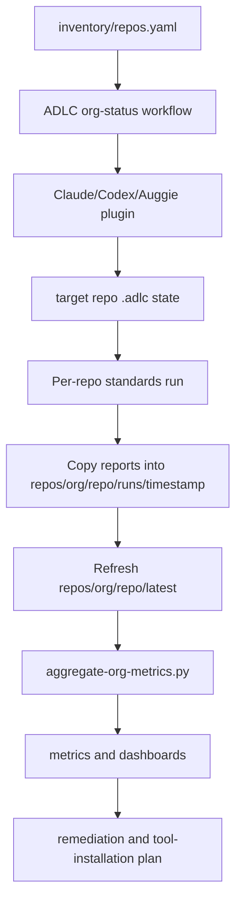

# Org Status Collection Repository

Date: 2026-05-19

## Purpose

The org status collection repository is the shared evidence and analytics repo for ADLC rollout. It collects the standards outputs from many repositories, keeps historical runs, exposes a stable `latest` view per repo, and generates org-wide metrics for leadership, platform engineering, security, and repo owners.

The collection repo is not a replacement for platform plugins. Claude, Codex, and Auggie still discover ADLC through their installed plugin surfaces. Each target repository keeps its own `.adlc/` lifecycle state, plans, reports, and proofs; the collection repo stores copied snapshots and aggregated metrics.

## Recommended Git Layout

```text
adlc-org-status/
  README.md
  inventory/
    repos.yaml
    owners.yaml
  repos/
    <github-org>/
      <repo-name>/
        latest/
          manifest.json
          reports/
          adlc/
          evidence/
        runs/
          2026-05-19T18-30-00Z/
            manifest.json
            reports/
            adlc/
            evidence/
  metrics/
    org-metrics.json
    org-metrics.md
  dashboards/
    coverage.md
    security.md
    complexity.md
    maintainability.md
    quick-wins.md
  plans/
    remediation-plan.md
    tool-installation-plan.md
    harness-rollout-plan.md
```

Initialize this layout locally with:

```bash
python3 scripts/init-org-status-repo.py --repo-path /absolute/path/to/adlc-org-status --org <github-org>
```

## Repo Inventory

`inventory/repos.yaml` should be the explicit source of truth for rollout scope.

```yaml
generated_at: "2026-05-19T00:00:00Z"
orgs:
  - name: example-org
    repositories:
      - name: service-a
        url: https://github.example.com/example-org/service-a
        owner: platform-team
        priority: high
      - name: service-b
        url: https://github.example.com/example-org/service-b
        owner: app-team
        priority: medium
```

## Target Repo Contract

For each repository in the inventory, the org-status workflow should:

1. Confirm the ADLC plugin is installed or available for the active platform.
2. Initialize shared `.adlc/` state with `create-adlc-harness` if missing.
3. Detect existing repo-local `.claude/`, `.codex/`, `.augment/`, or Superpowers harnesses and record them in `.adlc/harness.yaml`.
4. Avoid writing generic platform-local harness files unless the repo explicitly requested local overrides.
5. Run the required standards workflows.
6. Publish reports, `.adlc/status.md`, `.adlc/lifecycle.json`, active plan metadata, proof notes, and small test or coverage evidence into the collection repo snapshot with `publish-adlc-snapshot.py`.

The target repo publisher writes the same snapshot shape to both immutable history and stable latest paths:

```text
repos/<github-org>/<repo-name>/runs/<timestamp>/
repos/<github-org>/<repo-name>/latest/
```

Required files from each repo are:

```text
manifest.json
reports/org-standards.json
reports/org-standards.md
reports/code-quality.json
reports/code-quality.md
reports/project-codeguard-security.json
reports/project-codeguard-security.md
reports/ai-readiness.json
reports/ai-readiness.md
reports/bug-triage.json
reports/bug-triage.md
reports/requirements-to-tests.json
reports/requirements-to-tests.md
adlc/harness.yaml
adlc/lifecycle.json
adlc/status.md
```

If a repo has an active ADLC plan, the publisher also includes:

```text
adlc/plans/<run>/plan.md
adlc/plans/<run>/plan.yaml
adlc/plans/<run>/tests-and-evals.md
adlc/plans/<run>/work-items.md
adlc/plans/<run>/state.json
```

Central metrics and dashboards are computed inside `adlc-org-status` only. They are not written back into individual target repos.

## Metrics Generated

The ADLC metrics aggregator should compute:

- percent of repos meeting repository coverage policy
- repos missing machine-readable coverage artifacts
- percent of repos with high or critical security findings
- repos with too many security findings
- repos with large gaps
- repos with small, quickly actionable gaps
- repos with complexity risk
- repos with maintainability pass signals
- tool installation gaps by language and tool
- top recommended actions across the org

## Status Classes

| Class | Definition |
| --- | --- |
| Meets baseline | Overall status is `pass` and no high security findings are present. |
| Small gap | Overall status is `warn`, no high security findings, and the repo has at most three recommendations. |
| Large gap | Overall status is `fail`, coverage is below policy, or three or more areas are failing or warning. |
| Immediate attention | High security findings, critical findings, or too many security findings. |
| Missing evidence | No standards report, no coverage artifact, or no latest snapshot. |

## Multi-Repo Workflow



## GitHub Org Creation Workflow

When the coding-agent host has a GitHub MCP, GitHub app, or `gh` CLI with sufficient permissions, the ADLC org-status workflow should:

1. Confirm the target org and collection repo name.
2. Search for an existing repo with the requested name.
3. If it exists, use it and avoid creating a duplicate.
4. If it does not exist, create the repo with private visibility by default unless the org explicitly wants public.
5. Commit the recommended layout and starter inventory.
6. Have each target repo publisher push its own snapshot to `repos/<github-org>/<repo-name>/runs/<timestamp>/` and `repos/<github-org>/<repo-name>/latest/`.
7. Run central analytics inside the collection repo to generate `metrics/`, `dashboards/`, and org-level `plans/`.
8. Push the first metrics dashboard after the first collection run.

If no GitHub connector or CLI is available, the workflow should stop and explain the missing capability. It should not pretend the repository was created.

## Expected Plugin Workflows

- `create-adlc-harness`: initialize or refresh shared `.adlc/` state in a target repo.
- `steer-adlc-harness`: convert a task into a blueprint, work items, validation loop, and proof.
- `adlc-org-status-harness`: create a platform-independent orchestration plan for collection and metrics work.
- `publish-adlc-snapshot`: publish one target repo's reports, harness state, active plan, proofs, and small evidence files to this central repo.
- `run-org-repo-status`: run standards across a repo inventory and publish snapshots into this collection repo.
- `aggregate-org-metrics`: compute the org dashboard from collected reports.

Project CodeGuard remediation discovered during org review should not bypass planning. Use `fix-project-codeguard-findings` only after it routes through `steer-adlc-harness --task-type remediation` and writes the canonical `.adlc/plans/<run>/` artifacts in the target repo.

Generic org standards remediation should use `fix-org-standards-findings` for active-plan slice selection first. The target repo plugin reads `reports/org-standards.json`, continues `.adlc/lifecycle.json.active_plan`, writes selected and out-of-scope recommendations into that active plan, and only then can a human approve implementation of that scoped slice. After approved implementation, rerun `run-org-standards` before publishing the snapshot.

## Source Alignment

- OpenAI Symphony repository-owned `WORKFLOW.md` and isolated workspace model: https://github.com/openai/symphony/blob/main/SPEC.md
- OpenAI Codex harness engineering feedback-loop approach: https://openai.com/index/harness-engineering/
- Augment harness constraints, feedback loops, and quality gates: https://www.augmentcode.com/guides/harness-engineering-ai-coding-agents
